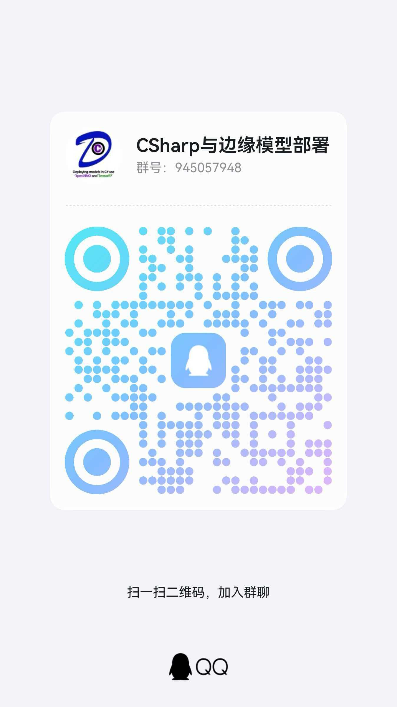

<!-- 3-Second Rule Optimized Profile -->

<!-- HEADER: 立即展示身份 -->
<div align="center">


<p>
  <a href="https://git.io/typing-svg">
    
  </a>
</p>

</div>

<!-- STATS BAR: 3秒看清交付力 -->
<div align="center">

[](https://github.com/guojin-yan)
[](https://github.com/guojin-yan?tab=repositories)
[](https://github.com/guojin-yan)
[](https://github.com/guojin-yan)

</div>

---

<!-- SOCIAL LINKS: 所有社交平台 -->
<h2 align="center">🌐 Connect With Me</h2>

<div align="center">

<!-- 技术社区 -->
<p>
  <a href="https://github.com/guojin-yan">
    
  </a>
  <a href="https://blog.csdn.net/Grape_yan">
    
  </a>
  <a href="https://www.cnblogs.com/guojin-blogs">
    
  </a>
</p>

<!-- 联系方式 -->
<p>
  <a href="mailto:guojin_yjs@cumt.edu.cn">
    
  </a>
  <a href="./image/qqgroup.jpg">
    
  </a>
  <a href="./image/wechataccount.png">
    
  </a>
  <a href="#微信公众号">
    
  </a>
</p>

</div>

---

<!-- TECH STACK: 3秒看清技术栈 -->
<h2 align="center">🎯 Tech Stack</h2>

<!-- 核心技能 -->
<p align="center">
  
  
  
  
  
</p>

<p align="center">
  
  
  
  
</p>

<p align="center">
  
  
  
  
</p>

<p align="center">
  
  
  
  
  
</p>

---

<!-- 🏆 主要项目展示 -->
<h2 align="center">🏆 Core Projects</h2>

<div align="center">

<!-- DeploySharp -->
<a href="https://github.com/guojin-yan/DeploySharp">
  
</a>

<p>
  
  
  
  
</p>

<p><i>🎯 Unified deep learning model deployment framework supporting multiple inference engines</i></p>

<br/>

<!-- OpenVINO & TensorRT -->
<table>
<tr>
<td width="50%" align="center">

### 🔷 OpenVINO-CSharp-API
<a href="https://github.com/guojin-yan/OpenVINO-CSharp-API">
  
</a>

<p>
  
  
  
</p>

<p><i>Complete C# API for Intel OpenVINO inference engine</i></p>

</td>
<td width="50%" align="center">

### 🔶 TensorRT-CSharp-API
<a href="https://github.com/guojin-yan/TensorRT-CSharp-API">
  
</a>

<p>
  
  
  
</p>

<p><i>High-performance NVIDIA GPU inference C# interface</i></p>

</td>
</tr>
</table>

</div>

---

<!-- 📦 其他项目 -->
<h2 align="center">📦 Model Deployment Projects</h2>

<div align="center">

<table>
<tr>
<td width="33%" align="center">

<a href="https://github.com/guojin-yan/YoloDeployCsharp">
  
</a>

<p>
  
  
</p>

</td>
<td width="33%" align="center">

<a href="https://github.com/guojin-yan/RT-DETR-OpenVINO">
  
</a>

<p>
  
  
</p>

</td>
<td width="33%" align="center">

<a href="https://github.com/guojin-yan/PaddleOCR-OpenVINO-CSharp">
  
</a>

<p>
  
  
</p>

</td>
</tr>
</table>

<table>
<tr>
<td width="50%" align="center">

<a href="https://github.com/guojin-yan/segment-anything-csharp">
  
</a>

<p>
  
  
</p>

</td>
<td width="50%" align="center">

<a href="https://github.com/guojin-yan/OpenVINO_deploy_PP-YOLOE">
  
</a>

<p>
  
  
</p>

</td>
</tr>
</table>

</div>

---

<!-- 📊 DELIVERY POWER -->
<h2 align="center">📊 Delivery Power</h2>

<div align="center">

<h3>💻 Language Distribution</h3>

```text
C#         ████████████████████████████████████████  45%
C++        ████████████████████████                  25%
Python     ████████████████████                      20%
Other      ██████████                                10%
```

<br/>

<h3>🔥 Contribution Overview</h3>

<p>
  
  
  
</p>

</div>

---

<!-- 🔥 ACTIVITY & BLOGS -->
<h2 align="center">🔥 Recent Activity & Blogs</h2>

<div align="center">

<table>
<tr>
<td width="25%">

<h3>📝 CSDN Blog</h3>

<a href="https://blog.csdn.net/Grape_yan">
  
</a>

<p align="center">
  <a href="https://blog.csdn.net/Grape_yan">
    
  </a>
</p>

</td>
<td width="25%">

<h3>📝 博客园</h3>

<!-- 博客园统计卡片 -->
<a href="https://www.cnblogs.com/guojin-blogs">
  
</a>

<br/><br/>

<p align="center">
  <a href="https://www.cnblogs.com/guojin-blogs">
    
  </a>
</p>

</td>
<td width="25%">

<h3>📱 微信公众号</h3>

<!-- 微信公众号二维码 -->
<a href="./image/wechataccount.png">
  
</a>

<p align="center"><i>扫码关注公众号</i></p>

</td>
<td width="25%">

<h3>👥 QQ交流群</h3>

<!-- QQ群二维码 -->
<a href="./image/qqgroup.jpg">
  
</a>

<p align="center"><i>扫码加入交流群</i></p>

</td>
</tr>
</table>

<br/>

<!-- 贡献日历 -->
<h3>📈 Contribution Calendar</h3>

<picture>
  <source media="(prefers-color-scheme: dark)" srcset="https://raw.githubusercontent.com/guojin-yan/guojin-yan/output/github-contribution-grid-snake-dark.svg"/>
  <source media="(prefers-color-scheme: light)" srcset="https://raw.githubusercontent.com/guojin-yan/guojin-yan/output/github-contribution-grid-snake.svg"/>
  
</picture>

<p><i>🐍 Auto-generated by GitHub Actions</i></p>

</div>

---

<!-- 🔗 FOOTER -->
<div align="center">

<h3>🔗 Quick Links</h3>

<p>
  <a href="https://github.com/guojin-yan">
    
  </a>
  <a href="https://blog.csdn.net/Grape_yan">
    
  </a>
  <a href="https://www.cnblogs.com/guojin-blogs">
    
  </a>
</p>

<p>
  <a href="mailto:guojin_yjs@cumt.edu.cn">
    
  </a>
  <a href="./image/qqgroup.jpg">
    
  </a>
  <a href="./image/wechataccount.png">
    
  </a>
</p>

<br/>


</div>
